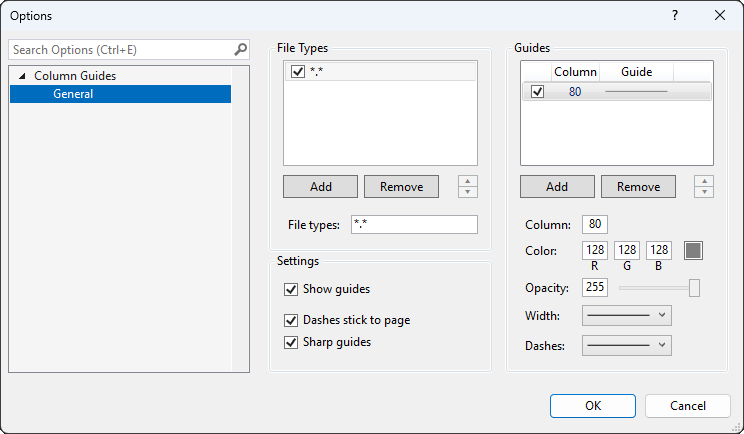

Column Guides lets you add vertical lines at character column positions in Visual Studio text editors. You specify the column, color, width, and dash style of each guide. You can associate a set of guides with one or more file types.

# Getting Started

In the **Extensions** menu, go to the **Column Guides** menu and select **Options**.

Column Guides installs with a default guide at column 80 for all file types.

> Note: To enter text values in the **Options** page without dismissing the dialog, select **Tab** to move to the next control or select **Space** to update the value in place.

# File Types

## Adding file types

Below the **File Types** list box, select the **Add** button. A new row will be added to the **File Types** list box with the default file type, \*.*.

## Removing file types

Select the row you want to remove in the **File Types** list box, then select the **Remove** button.

## Setting file types

In the **File Types** list box, select the row you want to edit.

In the **File types** text box, enter your file type. You can enter multiple file types by separating them with a semicolon (;).

## Ordering file types

To move a row up or down in the **File Types** list box, select the row, then select the ***▲*** or ***▼*** button.

>If a document matches more than one set of file types, its guides are drawn in the order the file types appear in the **File Types** list.

# Guides

## Adding guides

Below the **Guides** list box, select the **Add** button. A new guide will be added to the **Guides** list box with default settings.

## Removing guides

Select the guide you want to remove in the **Guides** list box, then select the **Remove** button.

## Guide settings

### Column

Enter the column at which a guide appears in the in the **Column** text box.

### Color

Enter the color of a guide in the **R**, **G**, and **B** text boxes. Values are *0-255*.

Alternatively, you can click on the color button to select a color from a dialog.

### Opacity

Enter the opacity of a guide in the **Opacity** text box. Values are *0-255*.

Alternatively, you can drag the slider to choose a value.

### Width

Select the width of a guide from the **Width** combo box.

### Dashes

Select the dash style of a guide from the **Dashes** combo box.

## Ordering guides

To move a guide up or down in the **Guides** list box, select the guide, then select the ***▲*** or ***▼*** button.

>If a file type has more than one guide, its guides are drawn in the order they appear in the **Guides** list.

# Global Settings

## Showing and hiding guides

To show all guides, select the **Show guides** checkbox.

To hide all guides, clear the **Show guides** checkbox.

You can also show and hide all guides in the **Column Guides** menu.

## Dashes

To make dashed lines to scroll with the page, select the **Dashes stick to page** checkbox.

To make dashed lines to float above the page, clear the **Dashes stick to page** checkbox.

## Rendering

To make guides snap to screen pixels and minimize anti-aliasing visual artifacts, select the **Sharp guides** checkbox.

To disable snapping to screen pixels, clear the **Sharp guides** checkbox.
